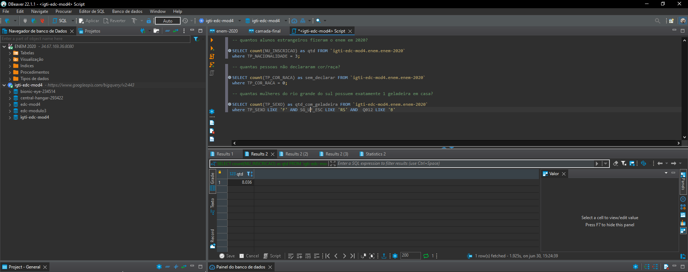
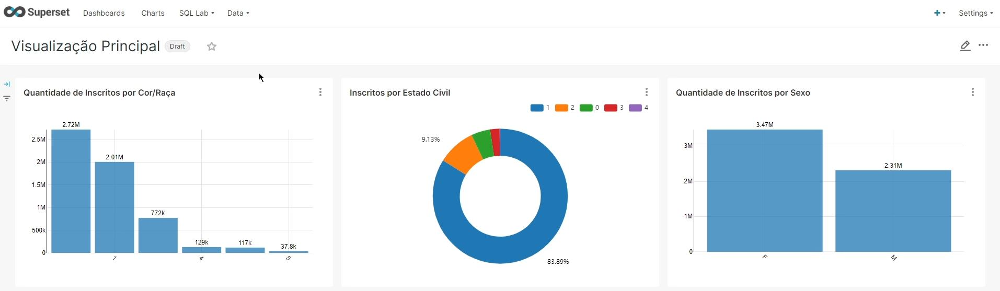

# 
  Repositório com transformações ETL e Agregação utilizando a base de dados do ENEM 2020 

## 
  Aqui podemos observar a camada de consumo dos dados, a primeira forma na qual podemos extrair insights a partir dos dados. 

## 
  Aqui podemos observar também a camada de consumo dos dados, no formato de visualização de dados. A forma mais prática na qual podemos extrair insights a partir dos dados. 

[Os dados do Enem ficam disponíveis aqui](https://www.gov.br/inep/pt-br/acesso-a-informacao/dados-abertos/microdados/enem)